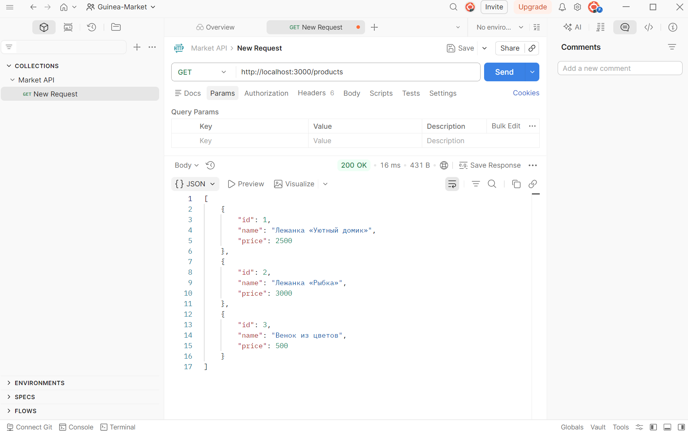
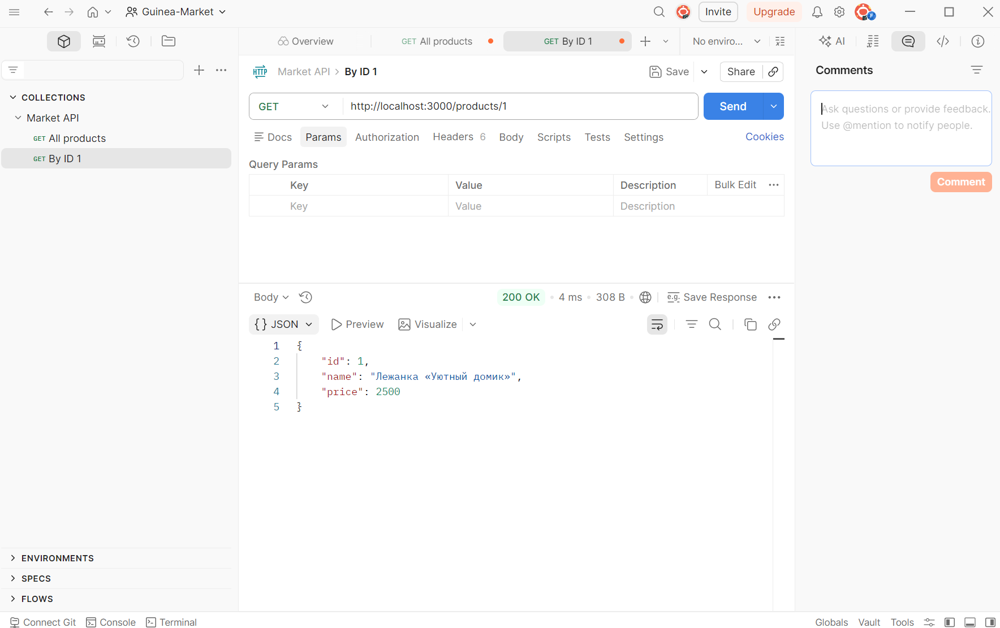
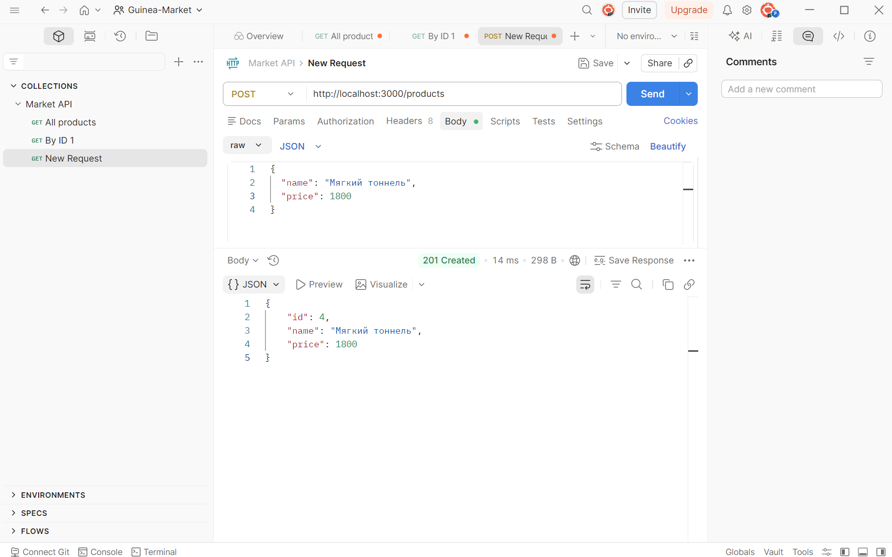
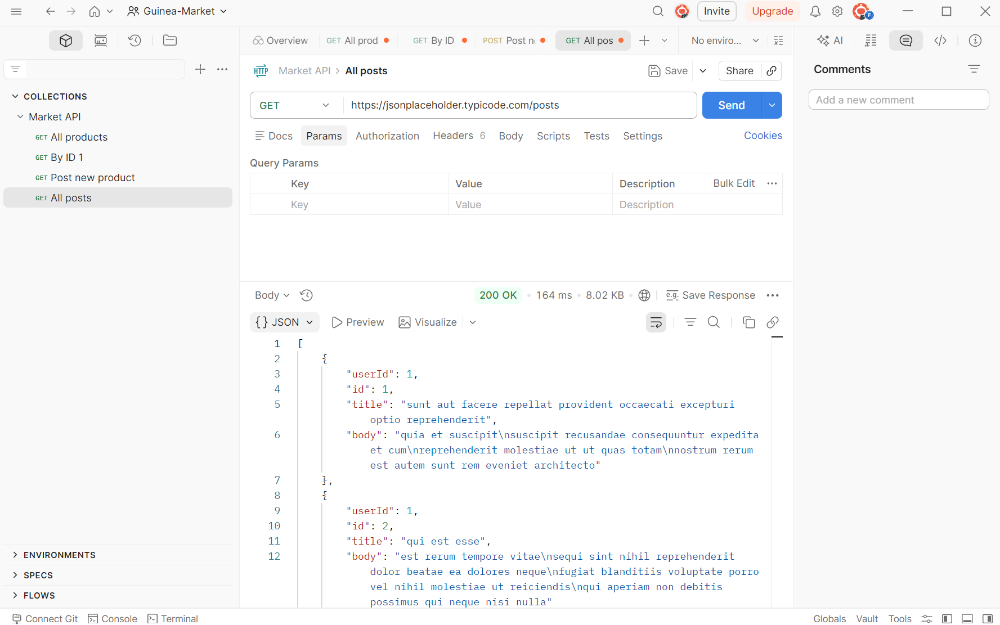
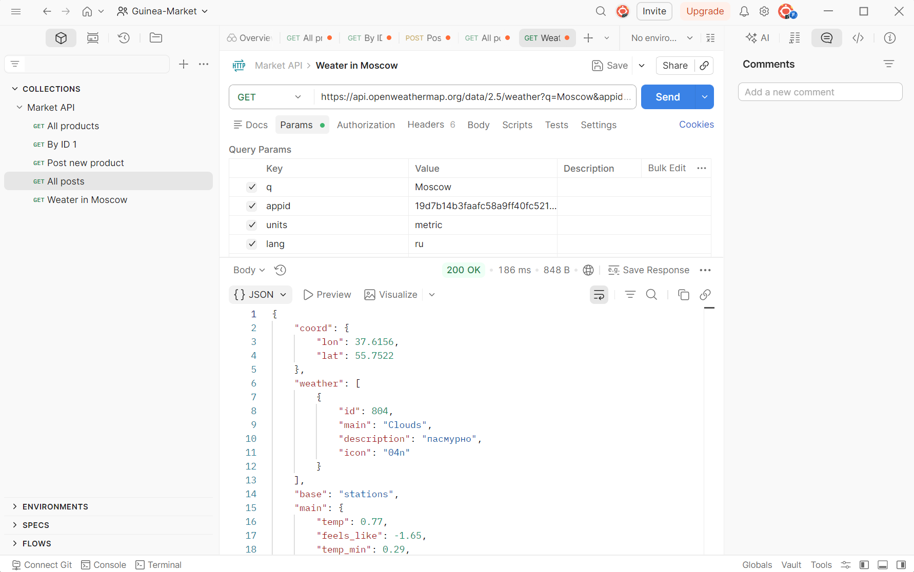
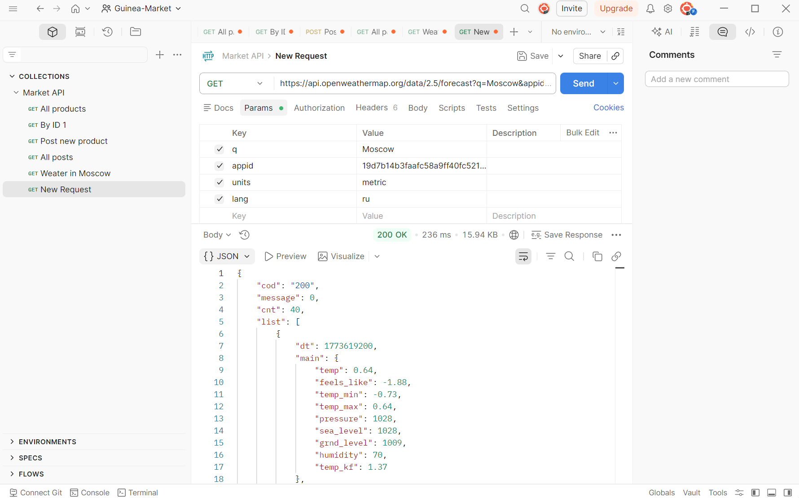
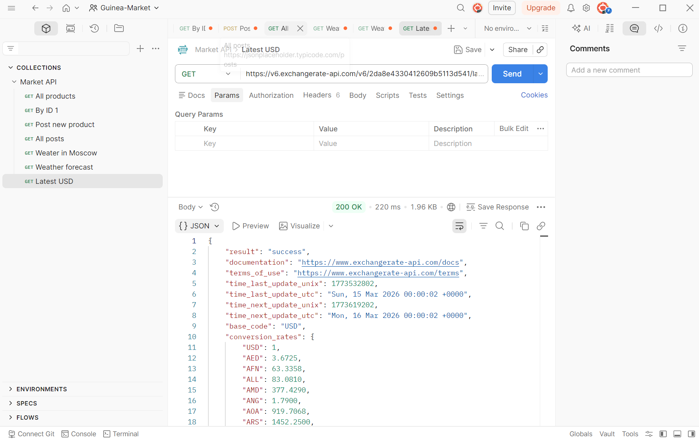
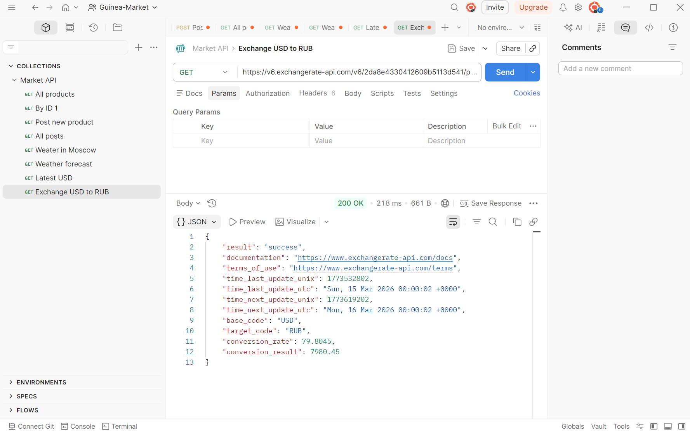

# Практическое занятие 3 — JSON и внешние API

## Локальный API (проект)

### 1) GET /products — список всех товаров

### 2) GET /products/1 — товар по ID

### 3) POST /products — добавление товара

## Внешние API

### 1) GET внешнего API — посты

### 2) GET внешнего API — погода в Москве

### 3) GET внешнего API — прогноз погоды

### 4) GET внешнего API — курсы валют (latest USD)

### 5) GET внешнего API — курс USD to RUB

